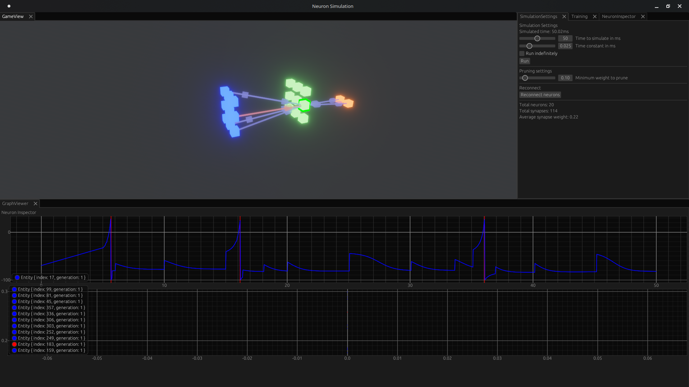

# Silicon

## Description
Silicon is a spiking neural network simulator written in Rust using the Bevy engine. It features a custom mathematical equation parser, a visualizer, and time control. Note that this is mostly a toy project and there are many features still missing.

This is primarily a learning project for me to learn more about spiking neural networks and the Bevy engine. I am not an expert in biology or game development, so please take everything with a grain of salt. Ideas, suggestions and contributions are welcome!



## Features
- Custom mathematical equation parser
- Visualizer
- Time control

### What I'd like to add

- Better visualizations and graphs
- More control over the network during runtime
- Simulated inputs/outputs
  - Game world for the network to interact with
- More complete documentation
- Better project structure

## Installation
To run the project, execute the following command in the root directory:
```sh
cargo run
```

## Usage
Usage examples will be provided once the project reaches a more complete state.

### License
This project is licensed under the GPLv3 License.
